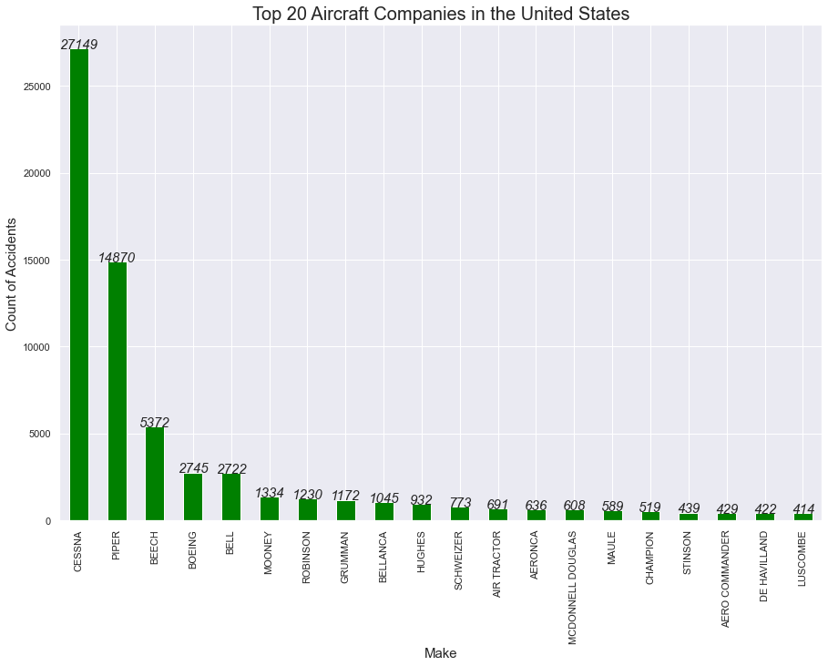
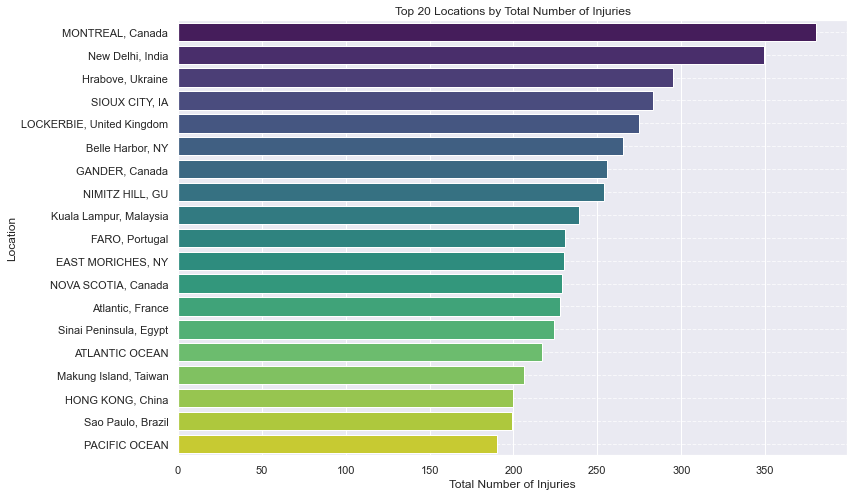

## Aviation-Analysis-Project

## Project Goal
The goal of this repository is to perform exploratory data analysis (EDA) on the aviation dataset provided. You'll explore various aspects such as weather conditions, aircraft models, flight phases, and airports associated with accidents or incidents. The analysis will include data cleaning,and data visualization

# Overview of the Aviation Data
The dataset contains information on aviation accidents, including the event ID, accident number, date, location, and country. It also provides details such as the purpose of the flight, fatalities, serious injuries, and weather conditions.

# Business Understanding
My project entails information that has previously been collected by different data scientists. The data is stored in **Kaggle**  and is stored in a **csv format**. When I read the data to my notebook using pandas library, I get a dataframe with 90348 rows and 31 columns. From a brief look at the dataframe, we realize that the information we are dealing with is from investigation of aircraft accidents. I have both categorical and continuous data , with the former making the most part of our data.

# Stakeholders:
## Internal Stakeholders:

Company executives (decision-makers).
Safety and operational teams.
Marketing and sales departments.
External Stakeholders:

## Investors.
Regulatory bodies (FAA, EASA).
Competitors.
Customers.
# Key Business Questions:
Which aircraft model presents the lowest safety risks?
How do operational costs vary across aircraft models?
How competitive is the pricing for the selected aircraft models?
What are the financial and safety risks associated with each aircraft?
# Data Understanding and Analysis
## Source of Data
The dataset used for this analysis includes historical records of aviation accidents across different aircraft models, sourced from aviation databases and reports.

## Description of Data
Event Date: Date of the accident or incident.
Location: Where the accident occurred.
Purpose of Flight: Whether the flight was personal, commercial, or for other purposes.
Fatalities and Injuries: Counts of total fatalities and injuries in each event.
Weather Conditions: Flight conditions such as IMC (Instrument Meteorological Conditions) or VMC (Visual Meteorological Conditions).
Phase of Flight: Phase during which the accident occurred (e.g., Cruise, Approach).
## Data Visualization
we have done data our data visualization 

In this plot, we are analysing the top 20  companies which are involved in most of the accidents. 'Cessna' has 25,853 accidents in the bucket whereas 'Piper' and ' Beech' have 14,168 and 2285 accidents, respectively.

from the above plot MONTREAL,canada has about 370 total number of injuries while San Franciso ,CA has the less total number of injuries 180

This plot illustrates that most of the accidents took place when aircraft was either Landing or Taking off. 14,902 accidents took place when the airplace was Landing and the weather conditions were clear for flight. About 15,385 accidents took place during take off with clear weather conditions.

# Conclusion
 ## Based on the analysis above we have discovered that:
 1. Most of the aviation accidents have taken place in the United States.
2. CESSNA and PIPER are Companies which manufactured aircrafts that are involved in accidents as per this dataset..
3. Most of the aviation incidents have taken place during Takeoff and Landing. Most of the times, weather conditions were favorable for flight.
4.Engine Type of both Fatal and Non-Fatal accidents was Reciprocating for most of the accidents.